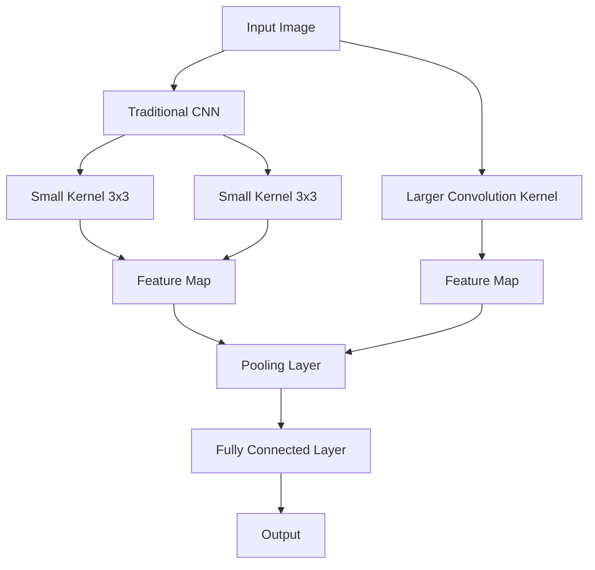

```mermaid
graph TD;
    A[Input Image] --> B[Traditional CNN]
    A --> C[Larger Convolution Kernel]
    B --> D[Small Kernel 3x3]
    B --> E[Small Kernel 3x3]
    D --> F[Feature Map]
    E --> F
    C --> G[Feature Map]  
    F --> H[Pooling Layer]
    G --> H
    H --> I[Fully Connected Layer]
    I --> J[Output]
```