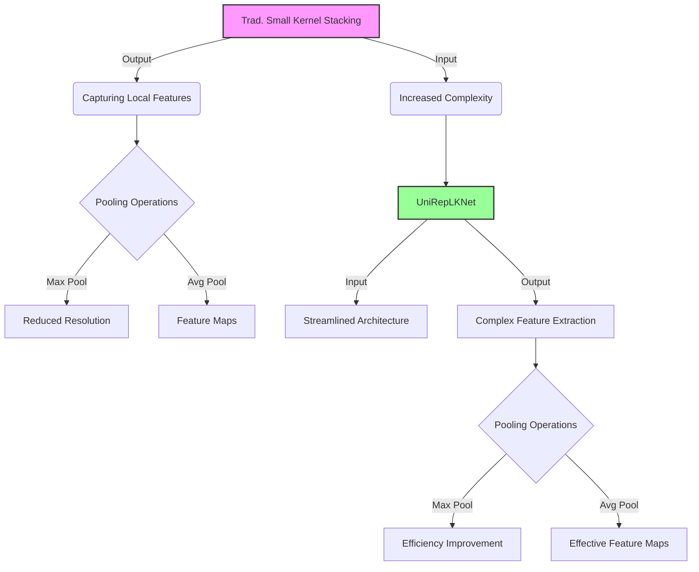

```mermaid
flowchart TB
    A[Trad. Small Kernel Stacking] -->|Input| B(Increased Complexity)
    A -->|Output| C(Capturing Local Features)
    C --> D{Pooling Operations}
    D -->|Max Pool| E[Reduced Resolution]
    D -->|Avg Pool| F[Feature Maps]
    
    B --> G[UniRepLKNet]
    G -->|Input| H[Streamlined Architecture]
    G -->|Output| I[Complex Feature Extraction]
    I --> J{Pooling Operations}
    J -->|Max Pool| K[Efficiency Improvement]
    J -->|Avg Pool| L[Effective Feature Maps]

    style A fill:#f9f,stroke:#333,stroke-width:2px;
    style G fill:#9f9,stroke:#333,stroke-width:2px;
```