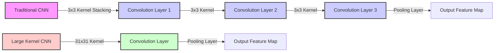

```mermaid
  graph LR
    A[Traditional CNN] -->|3x3 Kernel Stacking| B[Convolution Layer 1]
    B -->|3x3 Kernel| C[Convolution Layer 2]
    C -->|3x3 Kernel| D[Convolution Layer 3]
    D -->|Pooling Layer| E[Output Feature Map]
    F[Large Kernel CNN] -->|31x31 Kernel| G[Convolution Layer]
    G -->|Pooling Layer| H[Output Feature Map]
    style A fill:#f9f,stroke:#333,stroke-width:2px;
    style B fill:#ccf,stroke:#333,stroke-width:2px;
    style C fill:#ccf,stroke:#333,stroke-width:2px;
    style D fill:#ccf,stroke:#333,stroke-width:2px;
    style F fill:#ffcccc,stroke:#333,stroke-width:2px;
    style G fill:#ccffcc,stroke:#333,stroke-width:2px;
```